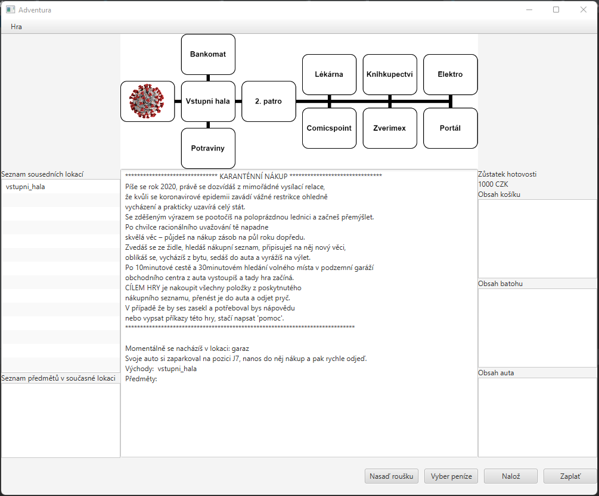

# adventure-game
:video_game: Adventure game themed after shopping madness during first months of COVID pandemic.

Written in Java, UI was made in JavaFX, testing in JUnit and built in Maven.

This game was initially developed as CLI only for university course, but UI was later added during following course.

Goal of the game is to purchase every item from the shopping list provided on start.

### Main screen

### Minigame
There is a minigame where player have to guess its own credit cards PIN code, in order to withdraw money.
This minigame is mandatory to finish, since terminals are overwhelmed, and player need the money to purchase all items from shopping list.
PIN code is randomly generated, and need to be guessed in each playing session.

### Victory screen
After purchasing every single item from the shopping list, and moving them all into players cars, the game ends.

